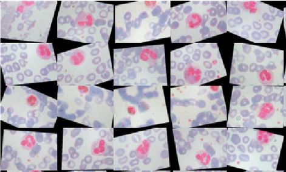
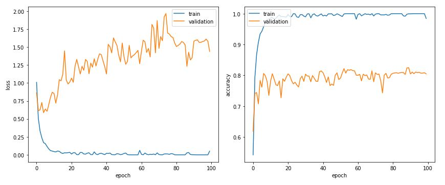
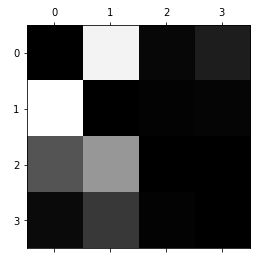

# Blood Cells Classifier

## Goal
Detect and classify white blood cell subtypes from images of patient blood samples. 
 

### Contributors
+ Ludvig Killingsberg
+ Maya Samet
+ Shakuntala Mitra
+ Zahra Afzal

## Background and Purpose
  Blood tests are commonly used in hospitals by medical professionals to aid them in their diagnosis of patients’ conditions. One of the most common tests is a CBC panel, or Complete Blood Count, which measures the percentage of various kinds of blood cells in a sample of patient’s blood. A CBC panel includes a WBC (white blood cell) count, which measures the amount of different white blood cells, such as lymphocytes, monocytes, neutrophils, basophils, and eosinophils. Normal, healthy human bodies have a typical range of each kind of white blood cell present in the blood. Too high or too low white blood cell counts can indicate an infection, immune system problems, or even cancer. 

  Hospital labs can take hours, or even days, to process just one patient sample, and the processing time and error only grows with each additional sample and type of blood chemistry requested by the physician. Hemocytometers, which are manual devices used to count cells, are time-consuming to use and incur additional error due to human fallibility. By training an image recognition program to identify and quantify different white blood cell types in patient blood samples, we will be hugely expediting the processing of patient blood samples, improving the accuracy of diagnostic blood test results, and laying a basis for a future predictive program that can potentially interpret and diagnose patients’ conditions. 

## Data
This Kaggle dataset contains 12,500 augmented images of blood cells (JPEG) with accompanying cell type labels (CSV). There are approximately 3,000 images for each of 4 different cell types grouped into 4 different folders (according to cell type). The cell types are Eosinophil, Lymphocyte, Monocyte, and Neutrophil. This dataset is accompanied by an additional dataset containing the original 410 images (pre-augmentation) as well as two additional subtype labels (WBC vs WBC) and also bounding boxes for each cell in each of these 410 images (JPEG + XML metadata). More specifically, the folder 'dataset-master' contains 410 images of blood cells with subtype labels and bounding boxes (JPEG + XML), while the folder 'dataset2-master' contains 2,500 augmented images as well as 4 additional subtype labels (JPEG + CSV). There are approximately 3,000 augmented images for each class of the 4 classes as compared to 88, 33, 21, and 207 images of each in folder 'dataset-master'.

## Methods

### Preprocessing
These are some examples of images from our datasets alongside some rotated images. The cells have been manually stained and photographed, such that the nuclei of the white blood cells have turned pink. The erythrocytes, or red blood cells, in the input images can be differentiated from the white blood cells by their lack of nuclei, which leaves them colorless due to the staining technique. When building a model to recognize complex shapes, a proportionately large dataset must be used to train the model. 

Here is a diagram showing the morphological differences between the different classes of white blood cells.

### Modeling
describing the CNN model and the layers of convolution

### Error Analysis
plots, metrics for success, etc.

## Summary
This will be updated after project completion.

## Key Results
This will be updated after project completion.

## Future Work
One of our main obstacles is the relatively small size of our dataset. This can be overcome by increasing the size of the dataset through data augmentation. In application, images of blood from patients may show white blood cells in inconsistent orientations, locations, image scale, etc. By augmenting our original dataset, we can simulate these conditions and allow our CNN model to robustly recognize cell types. Some image augmentations that we are trying are: rotations, color-shifting, mirroring, X- and Y-skew. 
The "dataset2-master" set includes rotated images, but the proportions for the classes of blood cells are normalized. We want to train our model while keeping the proportions of classes consistent with the original and augmented image data. 

The training dataset needs to be split into training and validation sets, since we are creating new augmented images to use for our model.

We need to test different models and produce graphs for the following:
  + dropout vs no dropout
  + different dropout rates
  + different numbers of layers (more convolution)
  + batch normalization vs no normalization
  + different activation function 
